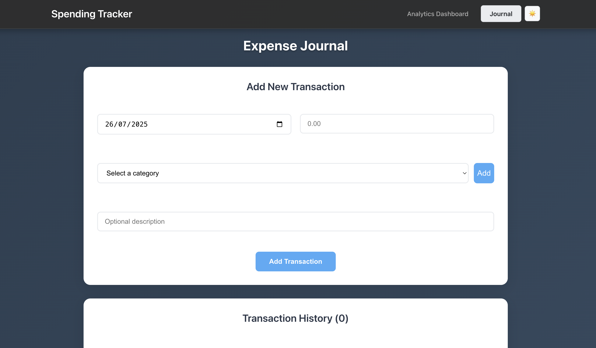
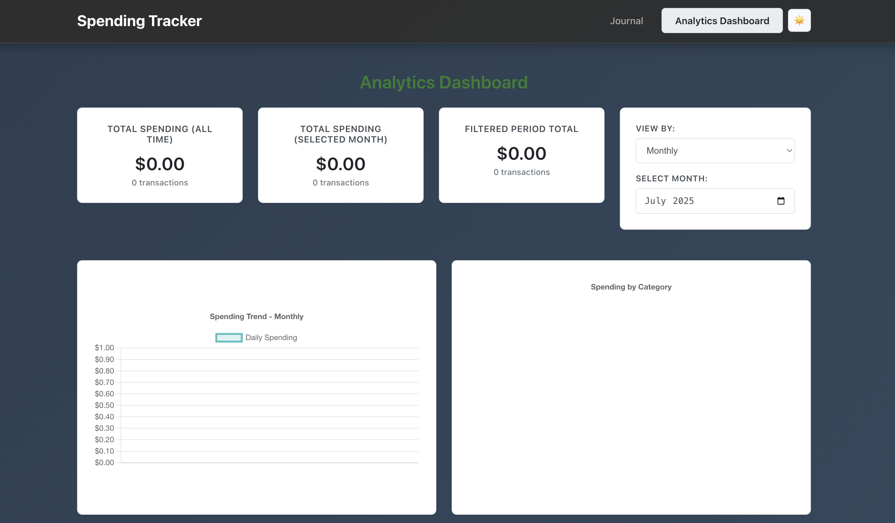

# Spending Tracker

A React-based web application for tracking personal expenses with analytics board.

## Live Demo
[https://teddybear-cooking.github.io/spend-tracker/]

## Contributors
Min La Wee Chan (6520189) • Arkar Phyo (6520052) • Swan Yi Win Thu Ya (6540200)

## Technologies Used
- React.js
- React Router (HashRouter)
- Chart.js with react-chartjs-2
- Local Storage for data persistence
- GitHub Pages for deployment

## Features

### Journal Page


- Add new transactions with:
  - Date 
  - Spending category 
  - Amount 
  - description
- Custom category management
  - Pre-defined categories from spending-category.json
  - Ability to add custom categories
- Transaction history with edit and delete functionality
- Single user application with no authentication required

### Analytics Dashboard


- Comprehensive spending overview:
  - Total spending (all time)
  - Total spending (selected month)
  - Filtered period total
- Flexible time filtering:
  - Daily view
  - Weekly view
  - Monthly view
- Data Visualization:
  - Line Chart: Spending trends over time
  - Pie Chart: Spending distribution by category
- Category-wise breakdown with transaction counts

## Data Storage
- Uses browser's Local Storage for data persistence
- No backend required
- Data structure includes:
  - Transaction records
  - Custom categories
  - User preferences

## Routing
- `/` - Journal page (default)
- `/journal` - Expense entry and transaction history
- `/analytics` - Spending analysis and visualization

## Getting Started

1. Clone the repository:
```bash
git clone https://github.com/teddybear-cooking/spend-tracker.git
```

2. Install dependencies:
```bash
cd spend-tracker
npm install
```

3. Run the development server:
```bash
npm start
```

4. Build for production:
```bash
npm run build
```

5. Deploy to GitHub Pages:
```bash
npm run deploy
```

## Note
This is a client-side only application. All data is stored in the browser's Local Storage.
